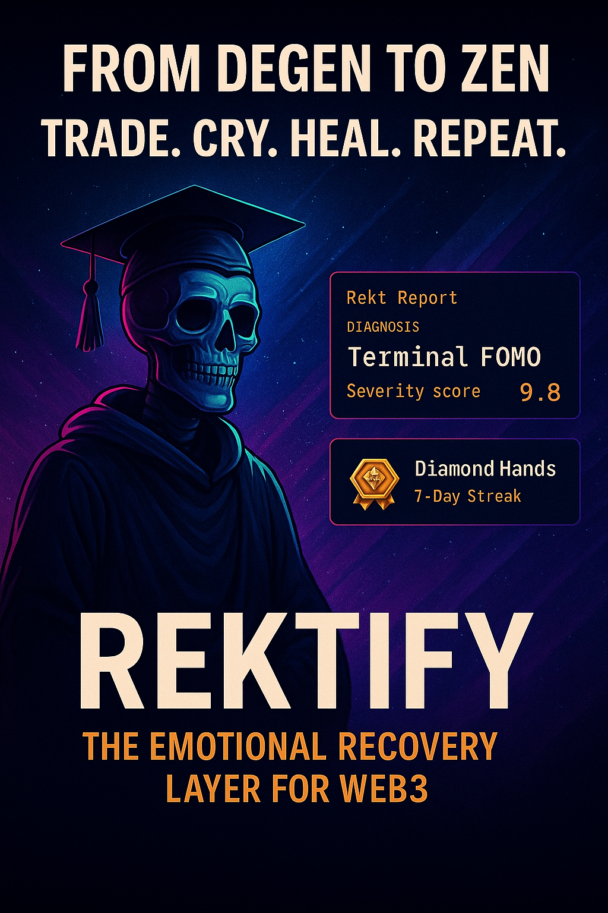

# 🧠 Rektify: Therapy for Degens

> Getting rekt is inevitable. Staying rekt is optional.

Rektify is the world’s first **AI-powered recovery platform for crypto degenerates**. Diagnose your worst trades, get roasted by Dr. Bags, and join a public Wall of Shame that’s funnier than your portfolio.

---

## ✨ Features

- **Rekt Report Generator** – Loss autopsy, trauma playlists, shareable memes
- **AI Therapy Chat** – Choose your flavor: Zen Stoic, Alpha Chad, or Full Clown 🤡
- **Leaderboard of the Damned** – Weekly rankings with NFT perks for top losers
- **Recovery Dashboard** – Track severity, streaks, and improvement over time
- **Badge System** – From “First Steps” to “Zen Master”

---

## 💸 Premium ($9/mo)

- Pattern alerts ("You always buy after Elon tweets")
- On-chain wallet analysis
- Green-hued “I’m Healing” memes
- Refer friends, earn 20%

---

## 🏁 Quickstart

1. Clone the repo or drag-and-drop on [Vercel](https://vercel.com/new/project?template=https://github.com/lykon3/rektify-recovery)
2. Rename `index.html` or update copy in your flavor
3. Connect backend or API endpoint (OpenAI, Claude, etc.)

---

## 🎯 Roadmap

- [ ] Real-time group recovery rooms
- [ ] NFT badge minting
- [ ] Weekly relapse alerts
- [ ] “Coach Mode” for recovered degens to mentor others

---

## 🤝 License

Meme-powered behavioral change is free and encouraged. Attribution welcome, shame optional.

---

> Built with pain. Deployed with love.  
> ~ The Founding Degen 💎

# Rektify

A cyberpunk AI therapy landing page for crypto degenerates.

Live demo coming soon.
